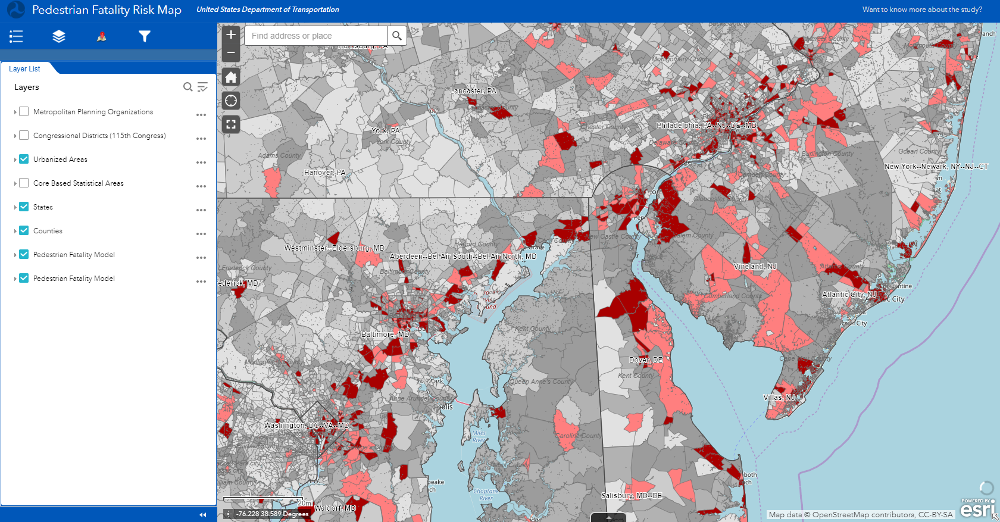

# Project Summary
Characteristics of the transportation system and built environment contribute to pedestrian fatality risks, including vehicular traffic and land-use characteristics associated with higher pedestrian activity. We combined data from FHWA, NHTSA, EPA, and the Census Bureau and performed regression modeling to explore associations between transportation system and built environment characteristics and pedestrian fatalities between 2012 and 2016 at the Census tract scale across the United States. In urban tracts, we found especially strong associations between traffic on non-access-controlled principal arterial and minor arterial roadways and pedestrian fatalities (0.91 and 0.68 additional annual pedestrian fatalities per 100,000 persons per 10,000 VMT/mi2 increase in traffic density, respectively). In both urban and rural tracts, we also found strong associations between employment density in the retail sector and pedestrian fatalities. Finally, we compared our model to the High Injury Network in Los Angeles, CA. Nearly half (43%) of observed fatalities were identified by both methods, while some fatalities were identified by only one (19% by our model and 23% by the High Injury Network). This work shows that traffic on certain roadway facility types and employment in certain sectors have especially strong associations with pedestrian fatality risk. More broadly, we illustrate how leveraging cross-disciplinary data in novel ways can support prospective, risk-based assessments of pedestrian fatality risks and support integrated and systemic approaches to transportation safety.

It should be noted that most but not all of the code used for the project is available on this site. 

# Interactive Web Application

https://maps.dot.gov/BTS/PedestrianFatalityModel/

# Contact
Overal Project Questions: 
paul.teicher@dot.gov

Questions Regarding Code or Model Structure:
theodore.mansfield@rsginc.com

Questions Regarding the Web Application:
kyle.titlow.ctr@dot.gov
